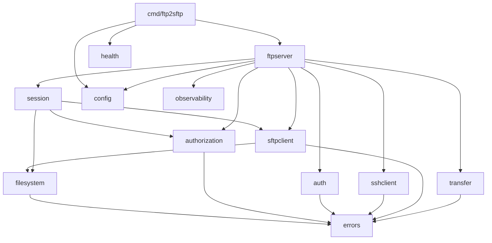
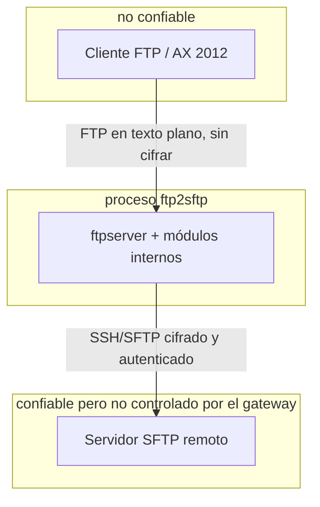

# Architecture Boundaries

Responsabilidad exacta de cada paquete bajo `internal/`. "No posee" lista
lo que un lector podría razonablemente esperar encontrar ahí pero que
vive deliberadamente en otro lugar.

| Paquete | Posee | No posee |
|---|---|---|
| `errors` | Taxonomía de errores de dominio; separación estricta entre mensaje seguro (`Error()`) y causa interna (`Unwrap()`, solo para logs) | Mapeo a códigos FTP (eso lo decide `ftpserverlib` por comando, ver `ADR/0002`) |
| `config` | Esquema YAML, defaults operativos, validación exhaustiva al inicio | Cualquier valor de negocio no declarado explícitamente en `FTP2SFTP-REQUIREMENTS.md` §13 |
| `filesystem` | Normalización y confinamiento de rutas virtuales↔remotas (`Mapper`), sin red | Verificación de symlinks remotos (requiere red; vive en `sftpclient`) |
| `auth` | Verificación de credenciales FTP (bcrypt), protección contra fuerza bruta por IP/usuario | Gestión de sesión, autorización por ruta |
| `authorization` | Permisos por operación (`Policy`), límite de concurrencia por usuario (`ConcurrencyGate`) | Resolución/validación de rutas |
| `sshclient` | Handshake SSH, verificación de host key contra `known_hosts`, timeouts | Semántica de archivos/SFTP |
| `sftpclient` | Operaciones SFTP confinadas, traducción de errores, defensa contra symlinks que escapan la raíz remota, estrategia de commit (`Commit`) | Política de negocio (qué se permite); orquestación de subida/descarga completa |
| `transfer` | Orquestación de una transferencia: nombre temporal (RF-007), streaming, SHA-256 opcional, limpieza ante fallo, resultado para auditoría | Parsing de comandos FTP; autenticación |
| `session` | Identidad de sesión (para auditoría y el nombre temporal), conexión SFTP diferida y su ciclo de vida | Directorio de trabajo actual ni estado de `RNFR` — ver nota abajo |
| `observability` | Logger estructurado, métricas en memoria (formato Prometheus), generación de IDs de correlación | Persistencia de métricas/logs (delegado al stdout + infraestructura externa) |
| `health` | Servidor HTTP interno `/healthz` `/readyz` `/metrics` | Lógica de negocio de "listo" (la decide el callback `ReadinessCheck` inyectado) |
| `ftpserver` | Adaptador `MainDriver`/`ClientDriver` hacia `ftpserverlib`; wiring de todos los módulos anteriores | Parsing de protocolo FTP; operaciones SFTP directas (delega a `sftpclient` vía `session`) |

## Dependencias permitidas

Regla: las dependencias apuntan hacia `errors`/`config`/`filesystem`
(estables, sin dependencias propias hacia el resto del árbol). Nada bajo
`internal/` importa `ftpserver` ni `cmd` — evita ciclos y mantiene el
adaptador de protocolo como la capa más externa.

## Por qué `session` no rastrea CWD ni `RNFR`

Se investigó el código fuente de `ftpserverlib` antes de implementar
`internal/session`. Confirmado:

- `ClientContext.Path()`/`SetPath()` ya rastrean el directorio virtual
  actual, con alcance correcto por conexión (`handleCWD`/`handleCDUP` en
  la librería llaman `driver.Stat(pathAbsolute)` y solo después
  `c.SetPath(...)`).
- El comando `RNTO` usa `c.ctxRnfr`, un campo interno del
  `clientHandler` de la librería — también con alcance correcto por
  conexión.

Duplicar ese estado en `session.Session` habría sido código muerto (nunca
leído por ningún llamador real) y una fuente de desincronización. Lo que
sí sigue siendo responsabilidad nuestra — porque la librería no lo
sabe — es que cualquier ruta ya absoluta y limpia que llegue al driver
puede seguir estando fuera de la raíz virtual configurada del usuario (si
esa raíz no es `/`), así que `internal/ftpserver` revalida confinamiento
en cada operación vía `filesystem.Mapper.ResolveVirtual`.

## Límites de confianza

- **AX ↔ gateway**: sin cifrado. Toda entrada de AX (rutas, nombres,
  secuencias de comandos) se trata como no confiable. La única mitigación
  real es de red (`docs/deployment/deployment-model.md`), no de
  protocolo.
- **gateway ↔ remoto**: cifrado y autenticado, pero el gateway no delega
  en el remoto ninguna garantía de confinamiento propia: aplica su propia
  raíz virtual incluso si el chroot remoto también existe (defensa en
  profundidad, no sustitución).
- **Proceso único, sin límite de red interno**: los "límites" entre
  paquetes son de compilación (`internal/*`), no de despliegue.

## Límite de autenticación

`AuthUser` (en `internal/ftpserver/gateway.go`) es el único punto donde
una conexión FTP pasa de "no confiable, sin identidad" a "confiable,
con una `session.Session` propia". Antes de ese punto, ningún comando
distinto de `USER`/`PASS`/`SYST`/`FEAT`/`NOOP`/`QUIT` tiene efecto (los
demás requieren un `ClientDriver`, que solo existe tras autenticar).

## Límite de fallos

Cada conexión FTP es independiente: un pánico o error irrecuperable en
una sesión (capturado por el manejo de errores de `ftpserverlib` y por
nuestros propios `error` explícitos, nunca por `panic` en código de
dominio) no afecta a otras sesiones. La única falla de proceso completo es
la caída del propio binario, mitigada por `healthSrv.SetAlive` y el
graceful shutdown documentado en `docs/architecture/overview.md`.
