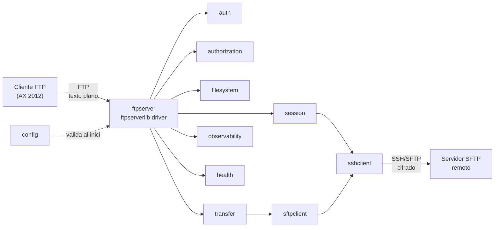
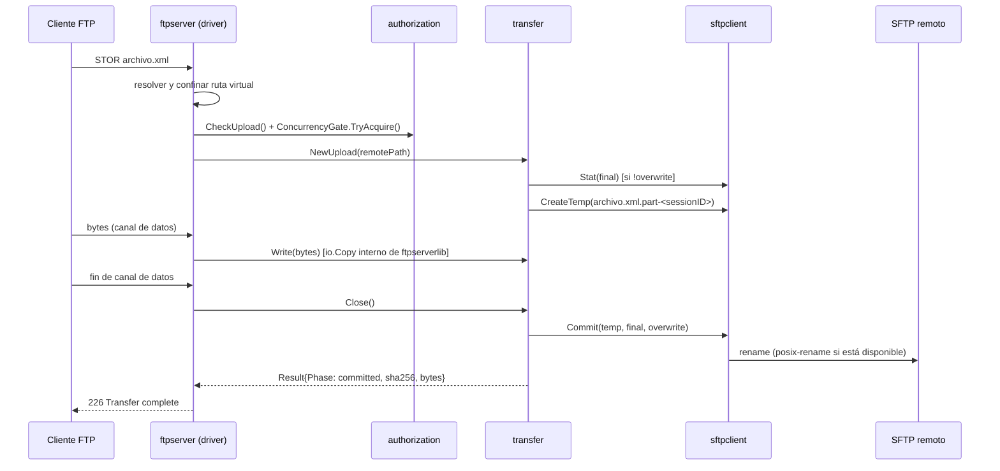
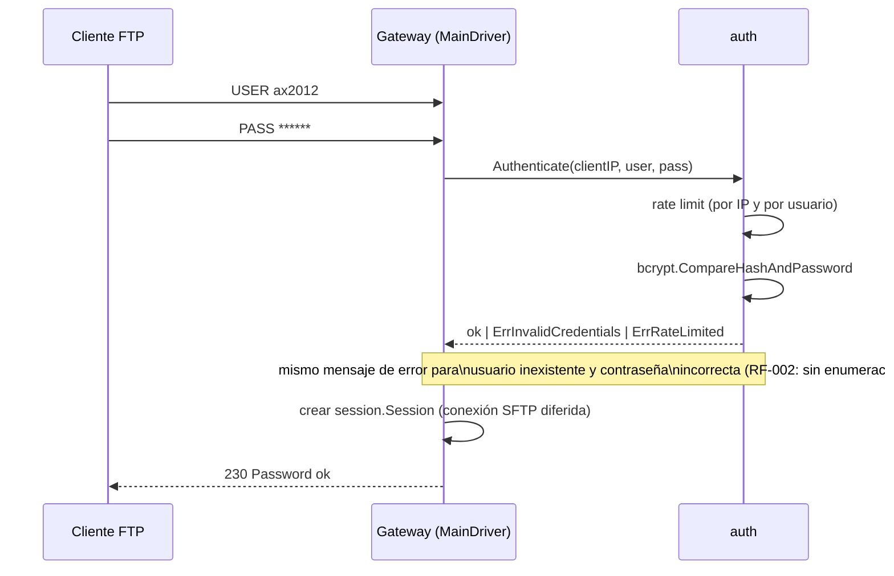
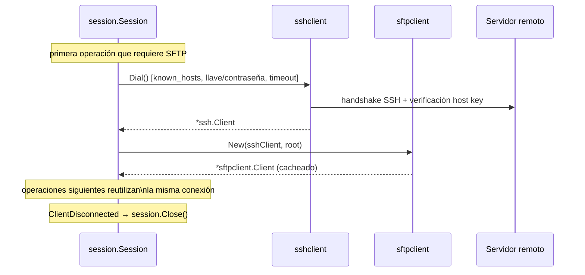
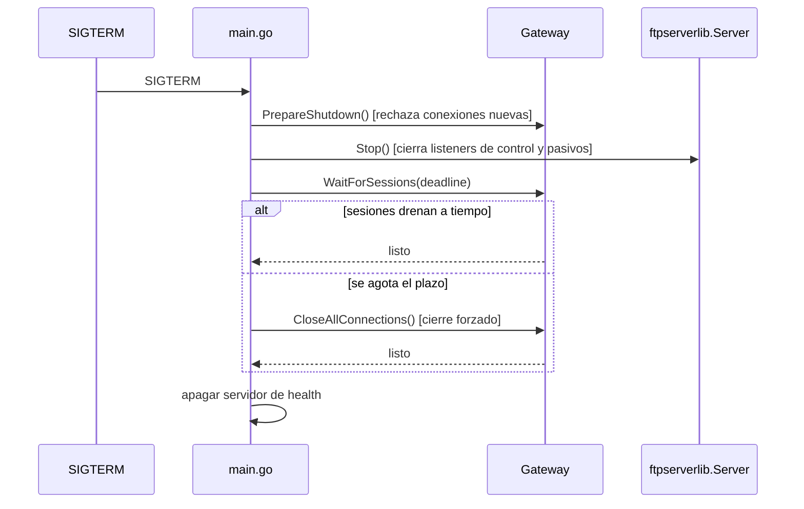

# Architecture Overview

Ver primero `docs/architecture/discovery.md` (descubrimiento previo al
diseño) y `FTP2SFTP-REQUIREMENTS.md` (fuente de verdad de requisitos).

## Propósito de negocio

Permitir que Microsoft Dynamics AX 2012 siga operando por FTP mientras el
servidor destino mantiene SFTP como único mecanismo de transferencia
seguro. `ftp2sftp` traduce operaciones (no bytes) entre ambos protocolos,
aplicando autenticación, autorización, confinamiento de rutas y
commit atómico de subidas.

## Componentes

Cada paquete bajo `internal/` corresponde a un nodo de este diagrama; ver
`docs/architecture/boundaries.md` para responsabilidades exactas y qué NO
posee cada uno.

## Decisión estructural: `ftpserverlib` como motor de protocolo FTP

`internal/ftpserver` no implementa el protocolo FTP (framing de comandos,
PASV/EPSV, códigos de respuesta): usa `github.com/fclairamb/ftpserverlib`
como motor de protocolo, y solo implementa las interfaces `MainDriver` y
`ClientDriver` (= `afero.Fs` + extensiones `GetHandle`/`ReadDir`/
`RemoveDir`). Esto es intencional: reimplementar FTP desde cero es
exactamente el tipo de riesgo de protocolo que `CLAUDE.md` pide evitar
("no implementar un protocolo complejo desde cero sin evaluar costo,
compatibilidad y riesgo"). Ver `ADR/0002-libreria-servidor-ftp.md`.

Consecuencia arquitectónica importante: `ftpserverlib` ya gestiona el
directorio de trabajo (`CWD`/`PWD`/`CDUP`) y el estado pendiente de
`RNFR` por conexión — `internal/session` deliberadamente NO duplica ese
estado (ver el comentario de paquete en `internal/session/session.go`).
Lo que `internal/filesystem.Mapper` sigue validando en cada operación es
el confinamiento a la raíz virtual del usuario, algo que la librería no
conoce.

## Flujo: subida (`STOR`)

Si algo falla en cualquier paso posterior a `CreateTemp`, `Close()` limpia
el temporal y nunca comete el archivo final (criterio de aceptación MVP
#6/#7). Ver `docs/protocols/ftp-sftp-gateway.md` para el detalle
operación por operación y `ADR/0005-estrategia-subida-atomica.md` para la
estrategia de commit.

## Flujo: login

## Flujo: conexión SFTP diferida por sesión

Cada sesión FTP autenticada obtiene su propia conexión SSH/SFTP,
establecida de forma perezosa en la primera operación que la necesita
(`PWD`/`CWD` ya requieren `Stat` remoto) y reutilizada durante el resto de
la sesión — ver `ADR/0004-estrategia-sesion-sftp.md` para la justificación
de "una sesión SSH por sesión FTP" frente a un pool.

## Flujo: graceful shutdown

Ver `cmd/ftp2sftp/main.go` (`shutdown`) para la implementación exacta y
`FTP2SFTP-REQUIREMENTS.md` §14.4 para el requisito.

## Deuda técnica conocida

- No hay pool de conexiones SSH; si AX abre una conexión de control por
  archivo, el costo de handshake por archivo debe medirse antes de
  optimizar (ver `docs/architecture/discovery.md` §6).
- Las métricas de duración (`*_duration_seconds`) son sumas simples, no
  histogramas reales — ver `ADR/0007-observabilidad.md`.
