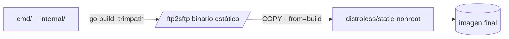

# Deployment Model

Este documento cubre la imagen Docker, la topología de red esperada en
producción y sus limitaciones reales — no solo el `docker-compose.yml` de
desarrollo (ver `deploy/docker/README.md` para ese).

`FTP2SFTP-REQUIREMENTS.md` §2.4 pide explícitamente no asumir nombres de
contenedores, redes o dominios de producción sin inspeccionar la
arquitectura real; este documento describe la topología **esperada** con
sus restricciones, no una topología ya verificada contra infraestructura
real.

## Imagen Docker

`Dockerfile` (raíz del repo), build multi-stage:

1. **build**: `golang:1.25-bookworm`, compila un binario estático
   (`CGO_ENABLED=0`) con símbolos de depuración eliminados (`-s -w`).
2. **runtime**: `gcr.io/distroless/static-debian12:nonroot` — sin shell,
   sin gestor de paquetes, corre como `nonroot` (uid 65532) por defecto.
   No hace falta crear un usuario propio ni un `USER` adicional: la
   imagen base ya lo impone.



### `HEALTHCHECK` sin shell

La imagen distroless no tiene `curl`/`wget`/shell, así que el
`HEALTHCHECK` de Docker no puede ser un comando externo. En su lugar, el
propio binario implementa `ftp2sftp --healthcheck`: carga la
configuración, resuelve `health.listenAddress`, y hace un `GET
/healthz` sobre loopback, devolviendo el código de salida apropiado (ver
`cmd/ftp2sftp/main.go:runHealthcheck`).

## Puertos

| Puerto | Propósito | Notas |
|---|---|---|
| `2121` (configurable, `server.controlPort`) | Control FTP | **No se usa el puerto 21 dentro del contenedor** — ver abajo |
| Rango pasivo (`server.passivePortStart`–`passivePortEnd`) | Canales de datos FTP | Debe coincidir exactamente con lo publicado por Docker/el firewall |
| `8080` (configurable, `health.listenAddress`) | Health/readiness/metrics | Nunca debe exponerse igual que el puerto FTP — es información operativa interna |

### Por qué no se usa el puerto 21 dentro del contenedor

El proceso corre como usuario no root (`nonroot`, uid 65532) por
requerimiento de seguridad (`FTP2SFTP-REQUIREMENTS.md` §14.1, "usuario no
root"). Un proceso no root no puede enlazar puertos privilegiados
(`<1024`) sin capacidades Linux adicionales (`CAP_NET_BIND_SERVICE`),
que a su vez ampliarían la superficie de la imagen. La solución estándar
— y la usada aquí — es que la aplicación escuche en un puerto no
privilegiado (`2121` por defecto) y que Docker (o el balanceador/firewall
delante) publique el puerto público `21` mapeado hacia `2121`:

```bash
docker run -p 21:2121 ...
```

Si el entorno real requiere que el propio proceso escuche literalmente en
`21` (p. ej. sin capacidad de mapeo de puertos en el orquestador), la
alternativa es otorgar `CAP_NET_BIND_SERVICE` al contenedor — evaluar
ese trade-off de superficie de ataque contra la conveniencia antes de
hacerlo; no es la opción por defecto de este proyecto.

## Redes

Documentado a nivel de restricciones, no de nombres reales (no
verificados contra infraestructura real):

- **Origen de conexiones FTP**: debe ser una red privada o un túnel
  controlado. `FTP2SFTP-REQUIREMENTS.md` §9.5 lo exige explícitamente:
  "el listener debe limitarse a red interna o túnel controlado; no debe
  exponerse públicamente sin una decisión de riesgo explícita".
- **Salida hacia SFTP**: conexión saliente TCP/22 (o el puerto
  configurado) desde el contenedor `ftp2sftp` hacia el servidor SFTP
  remoto. Preferiblemente sin exponer ese servidor directamente a
  Internet (`FTP2SFTP-REQUIREMENTS.md` §2.4).
- **`cloudflared`**: la arquitectura contempla un túnel Cloudflare Zero
  Trust para publicar o alcanzar servicios TCP, ejecutándose como su
  propio contenedor en la misma red Docker o en una red con acceso
  controlado. Este repositorio no incluye una configuración de
  `cloudflared` porque hacerlo requeriría nombres de túnel, credenciales
  de cuenta y topología real no disponibles en este entorno — ver
  limitación explícita abajo.

### Limitación explícita: FTP sobre un túnel TCP simple

**Un solo túnel TCP hacia el puerto de control (21/2121) NO resuelve
automáticamente los canales de datos pasivos de FTP.** FTP es
multi-conexión por diseño: el canal de control negocia un puerto
efímero distinto para cada transferencia (`PASV`/`EPSV`), y el cliente
abre una segunda conexión TCP a ese puerto. Un túnel que solo reenvía el
puerto de control no reenvía esos puertos de datos dinámicos.

Para que el modo pasivo funcione a través de un túnel:

1. El túnel debe reenviar **todo el rango pasivo configurado**
   (`server.passivePortStart`–`passivePortEnd`), no solo el puerto de
   control — esto implica un rango pequeño y fijo es preferible a uno
   grande, por el costo operativo de mantener cada puerto reenviado.
2. `server.passiveAddress` debe ser la dirección que el **cliente**
   puede alcanzar después del túnel (no la IP interna del contenedor) —
   si el cliente FTP y el gateway están en la misma red privada sin
   túnel de por medio, esto es simplemente la IP/hostname interno; si
   hay NAT o túnel involucrado, debe ser la dirección pública/anunciada
   correspondiente.
3. Si el túnel no soporta reenviar un rango de puertos dinámico
   (algunos productos de túnel solo exponen un puerto o servicio fijo
   por regla), el modo pasivo tal como está diseñado no es viable sobre
   ese túnel — la alternativa sería modo activo (no implementado,
   ver `docs/protocols/ftp-behavior.md#modo-pasivo`) o replantear la
   topología (p. ej. gateway y AX en la misma red privada, sin túnel de
   por medio para el tráfico FTP, reservando el túnel solo para
   necesidades de gestión).

Esta restricción debe verificarse contra el producto de túnel real antes
de decidir el rango pasivo en producción — no se asume una solución aquí.

## Configuración

Externa al binario, montada como archivo YAML de solo lectura (ver
`configs/config.example.yaml`). Ruta configurable vía `CONFIG_FILE` o el
flag `--config` (por defecto `/app/config/config.yaml`). Validación
exhaustiva al arranque (`internal/config`): el proceso no inicia con
configuración inválida, en vez de arrancar en un estado parcialmente
funcional.

## Secretos

Ver `docs/security/security-model.md#gestión-de-secretos`. Resumen para
despliegue: la llave privada SFTP se monta como archivo de solo lectura
(p. ej. `/run/secrets/sftp_private_key` vía Docker secrets, un
`Secret`/`ConfigMap` de Kubernetes, o un volumen montado con permisos
restrictivos) — nunca como variable de entorno, nunca horneada en la
imagen.

## Almacenamiento persistente

No hay persistencia de archivos de negocio dentro del gateway (es
tránsito, no almacenamiento — `FTP2SFTP-REQUIREMENTS.md` §4 lo excluye
explícitamente). Lo único que podría beneficiarse de un volumen:

- `known_hosts`: archivo de configuración no secreto, versionable fuera
  de git según la política del operador.
- Logs, si no se envían a stdout (por defecto van a stdout, delegando
  persistencia a la plataforma de logs del operador).

No hay archivos temporales locales: los temporales de subida
(`archivo.xml.part-<sessionId>`) viven en el servidor SFTP remoto, nunca
en el filesystem del contenedor `ftp2sftp` — ver
`docs/protocols/ftp-sftp-gateway.md#streaming-vs-archivos-temporales`.

## Health y readiness

- `GET /healthz`: proceso vivo (`health.Server.SetAlive`, activado tras
  bind exitoso del listener FTP). No depende de la conectividad SFTP
  (RF-016: "la conectividad SFTP no debe bloquear necesariamente el
  health check del proceso").
- `GET /readyz`: además de vivo, si `health.readinessRequiresSftp: true`,
  intenta una conexión SFTP real y de corta duración contra **cada**
  usuario configurado (política "no listo si cualquier backend está
  inaccesible" — ver `cmd/ftp2sftp/main.go:readinessCheck`), acotada a 5
  segundos por el propio servidor de health.
- `GET /metrics`: formato de texto Prometheus, ver
  `internal/observability/metrics.go`.

## Graceful shutdown

Ver `docs/architecture/overview.md#flujo-graceful-shutdown` para el
diagrama de secuencia. Orquestadores (Docker, Kubernetes, systemd) deben
enviar `SIGTERM` y esperar al menos `server.shutdownTimeout` más un
margen antes de forzar `SIGKILL`, o las transferencias en curso se
cortarán de forma abrupta en vez de completarse o limpiarse
correctamente.

## Rollback

Sin estado persistente propio que migrar, el rollback es reemplazar la
imagen por la versión anterior y reiniciar. Único cuidado: si el nuevo
formato de configuración YAML introdujo campos no reconocidos por una
versión anterior del binario, ese binario los ignorará silenciosamente
(comportamiento de `gopkg.in/yaml.v3` con campos desconocidos) — no hay
verificación de compatibilidad de esquema entre versiones en el MVP.

## Escalado

Fuera de alcance del MVP (`FTP2SFTP-REQUIREMENTS.md` §4: "alta
disponibilidad activa-activa" explícitamente excluida). Un solo proceso
mantiene todo el estado de sesión en memoria; escalar horizontalmente
requeriría repensar afinidad de sesión FTP (un cliente FTP mantiene una
única conexión de control durante toda su operación, así que "sticky" no
es tan crítico como en HTTP, pero el estado de auditoría/métricas sí
quedaría fragmentado entre réplicas sin trabajo adicional).

## Monitoreo

`GET /metrics` expone contadores/gauges en formato de texto Prometheus
(`internal/observability/metrics.go`) — compatible con cualquier
recolector que hable ese formato (Prometheus, VictoriaMetrics, etc. vía
scraping HTTP estándar). No se asume una plataforma específica: la
decisión pendiente #17 de `FTP2SFTP-REQUIREMENTS.md` ("¿qué formato de
logs y plataforma de monitoreo se utilizará?") permanece abierta;
`ftp2sftp` solo garantiza el formato de salida, no la plataforma de
destino.
