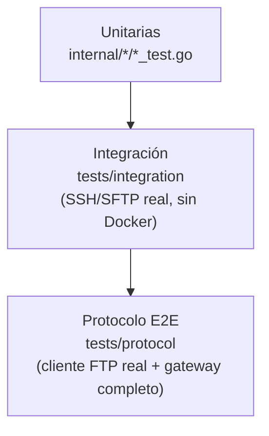

# Testing Strategy

Qué se probó, cómo, y qué queda pendiente. Todo lo descrito aquí se
ejecutó realmente en este entorno (ver comandos al final); nada en este
documento es aspiracional.

## Resumen ejecutado

```bash
go build ./...
go vet ./...
gofmt -l .        # sin salida
go test ./...
go test -race ./...
```

Todos los paquetes compilan, pasan `go vet`, están formateados con
`gofmt`, y pasan sus pruebas con y sin el detector de carreras.

## Pirámide de pruebas de este proyecto



## Unitarias (`internal/*/*_test.go`)

Cobertura por paquete (resumen; ver cada `*_test.go` para el detalle):

| Paquete | Qué se prueba |
|---|---|
| `errors` | El mensaje público nunca incluye la causa interna; `errors.Is`/`As` a través de cadenas envueltas |
| `config` | Carga válida, archivo faltante, rango pasivo insuficiente, usuarios duplicados, llave+contraseña simultáneas, hash no-bcrypt, `known_hosts` faltante |
| `filesystem` | Navegación normal, **ataques de traversal explícitos** (`../../../etc/passwd` y variantes), bytes NUL, raíces virtuales no-`/` |
| `auth` | Éxito, fallo, mismo error para usuario inexistente vs. contraseña incorrecta, bloqueo tras fallos repetidos, reseteo tras éxito, uso concurrente del limitador (`-race`) |
| `authorization` | Denegación por defecto (valor cero), límite de tamaño, semáforo de concurrencia bajo uso concurrente (`-race`) |
| `sshclient` | Conexión exitosa, **host key inválida rechazada**, contraseña incorrecta, sin método de auth configurado, timeout de conexión — contra un servidor SSH real en memoria (no un mock) |
| `transfer` | Commit exitoso con SHA-256 correcto, rechazo de destino existente sin overwrite, límite de tamaño con limpieza de temporal, `TransferError` con limpieza, idempotencia de `Close`, lectura/escritura no soportada según dirección |
| `session` | Identidad, conexión SFTP diferida y reutilizada, invalidación fuerza redial, uso tras `Close` falla |
| `observability` | Formato de logger, contenido de métricas Prometheus, uso concurrente de contadores/gauges (`-race`), unicidad de IDs de correlación, **redacción de `PASS` en logs de protocolo** |
| `health` | `/healthz` refleja el flag de vida, `/readyz` respeta el chequeo de SFTP inyectado y su timeout, `/metrics` sirve texto Prometheus |
| `ftpserver` | Límite de conexiones máximas (incluida contabilidad simétrica de conexiones rechazadas), rechazo durante shutdown, sesión rastreada correctamente en éxito/fallo de auth, `WaitForSessions` respeta la señal de plazo, rate limiting de auth |

## Integración (`tests/integration`)

Estrategia elegida: **servidor SSH/SFTP real en el propio proceso de
prueba** (`tests/testutil.StartSFTPServer`), en vez de Docker, para que
`go test ./...` sea hermético y reproducible sin dependencias externas —
opción explícitamente permitida por `FTP2SFTP-REQUIREMENTS.md` §15.2
("Docker **o** una estrategia reproducible"). Usa
`golang.org/x/crypto/ssh` y `github.com/pkg/sftp` en sus dos lados
(cliente real de `internal/sshclient`/`internal/sftpclient`, servidor
real de `pkg/sftp`), respaldado por el filesystem real de un directorio
temporal — no hay ningún mock del protocolo SFTP.

Cubre (`FTP2SFTP-REQUIREMENTS.md` §15.2): conexión, host key válida e
inválida, autenticación (correcta/incorrecta), subida con commit,
subida fallida sin dejar archivo final ni temporal huérfano, descarga,
listado, rename atómico, rename rechazado si el destino existe,
**permiso denegado real** (vía `chmod 000` en un directorio, no
simulado), timeout de conexión contra una IP no enrutable, cierre de
conexión.

**Complemento con Docker**: `docker-compose.yml` +
`deploy/docker/README.md` levantan un servidor SFTP real independiente
(`atmoz/sftp`, una implementación de servidor SFTP genuinamente distinta
de `pkg/sftp`) para verificación manual — útil precisamente porque es una
implementación distinta a la que usan las pruebas automatizadas, y por lo
tanto una señal adicional de interoperabilidad real. No está conectado a
`go test` por diseño (evita que la suite dependa de Docker estando
disponible).

## Protocolo FTP extremo a extremo (`tests/protocol`)

Cliente FTP real e independiente (`github.com/jlaffaye/ftp`, dependencia
de solo pruebas) contra el `Gateway` completo (`ftpserver.New` +
`libftpserver.FtpServer` reales) respaldado por el mismo servidor
SSH/SFTP en memoria de `tests/testutil`.

Cubre (`FTP2SFTP-REQUIREMENTS.md` §15.3): login, `PWD`/`CWD`, `PASV`
(único modo probado — activo no soportado), `LIST`, `STOR`, `RETR`,
**múltiples sesiones concurrentes**, credenciales inválidas, permisos
denegados por operación (`AllowDownload`/`AllowDelete`/`AllowMkdir` en
`false`), traversal de rutas vía un cliente FTP real (no solo a nivel de
función interna), y que un archivo `.part-<sessionId>` **nunca aparece en
un listado** mientras la subida está en curso.

## Concurrencia (`tests/protocol/concurrency_test.go`, `-race`)

- Subidas concurrentes con nombres distintos: todas deben completarse
  íntegras.
- Subidas concurrentes al **mismo nombre final**: cada una obtiene su
  propio temporal (sufijo por `sessionId`, RF-007); ninguna corrompe a
  otra; al final existe exactamente un archivo, nunca una mezcla de
  contenidos ni temporales huérfanos.
- Límite de concurrencia por usuario: al menos uno de dos intentos
  simultáneos por encima del límite configurado es rechazado en vez de
  ambos completar silenciosamente por encima del límite.

`go test -race ./...` se ejecutó sobre **todo** el repositorio, no solo
sobre estas pruebas dirigidas — sin reportes de carrera.

## Calidad de código

```bash
go fmt ./...   # gofmt -l . no reporta archivos sin formatear
go vet ./...   # sin hallazgos
go build ./... # sin errores ni warnings
```

No se usaron linters adicionales más allá de las herramientas estándar de
Go (`golangci-lint` u otros no están instalados en este entorno; si se
adoptan, deben justificarse y fijarse por versión según la política de
dependencias del proyecto).

## Lo que NO se probó (limitaciones honestas)

- **Compatibilidad real con AX 2012**: no se tuvo acceso a una instancia
  de AX 2012 en este entorno. Ver
  `docs/protocols/ftp-behavior.md#validación-manual-con-ax-2012` para la
  lista de validación manual pendiente antes de declarar compatibilidad.
- **Modo activo (`PORT`)**: no implementado, por lo tanto no probado.
- **Pruebas de carga/rendimiento con datos reales**: no se ejecutaron
  pruebas de throughput o de límites de conexión bajo carga sostenida;
  los objetivos concretos de throughput dependen de datos reales no
  disponibles (`FTP2SFTP-REQUIREMENTS.md` RNF-002).
- **Cliente lento / desconexión abrupta durante transferencia real desde
  un cliente FTP externo**: cubierto indirectamente por
  `TestUploadTransferErrorTriggersCleanup` (a nivel de
  `internal/transfer`, simulando la señal que `ftpserverlib` emite en ese
  caso) pero no con un cliente FTP real cortando la conexión a mitad de
  una transferencia grande.
- **Interoperabilidad contra un segundo servidor SFTP de producción**
  real (más allá de `atmoz/sftp` en el compose de desarrollo): no
  ejecutado en este entorno.
- **Rotación de `known_hosts`/llaves en caliente**: el comportamiento
  documentado (`docs/security/security-model.md#rotación-de-credenciales`)
  no tiene una prueba automatizada dedicada.

## Cómo extender esta suite

- Nuevas operaciones FTP: agregar caso en `tests/protocol/ftp_e2e_test.go`
  usando el mismo patrón `startGateway`/`loginOrFail`.
- Nuevos escenarios de fallo de red/SFTP: extender
  `tests/testutil.SFTPServer` o añadir un caso en
  `tests/integration/sftp_integration_test.go`.
- Antes de marcar cualquier comportamiento como "compatible con AX 2012",
  completar la validación manual de
  `docs/protocols/ftp-behavior.md` y, si es posible, capturar la sesión
  real como fixture para una prueba de regresión futura.
